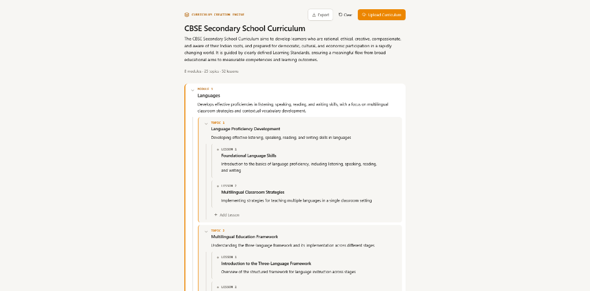

# Lingocare Curriculum Creation Engine

A web-based Curriculum Creation Engine for vocational and nursing education (Curriculum → Module → Topic → Lesson), supporting both **manual authoring** (Notion-style inline editing) and **AI-powered document ingestion** (parsing PDFs with structured LLM extraction).

Both entry points converge into the **exact same normalized data model and recursive UI components**, ensuring AI-generated content is immediately editable with zero confirmation friction.



---

## Key Features

* **Unified 4-Level Tree**: Strict `Curriculum → Module → Topic → Lesson` hierarchy with depth-driven typography, border weights, and indent guidelines.
* **Always-Editable Inline UI**: Notion-style auto-resizing textareas for titles and descriptions—no modal popups, edit-mode toggles, or save buttons.
* **Auto-Focus Interaction**: Creating a new module, topic, or lesson automatically focuses the title input with cursor placed at the end for frictionless, keyboard-first creation.
* **2-Pass Chunked AI Ingestion (Map-Reduce)**:
  * **Pass 1 (Discovery & Outline)**: Scans the document with low-token overhead to identify program metadata and unique module boundaries without context truncation.
  * **Pass 2 (Per-Module Extraction & Streaming)**: Processes individual module chunks to extract or infer detailed Topics and Lessons.
  * **Live Streaming (NDJSON)**: Completed modules stream progressively to the screen with a live progress indicator.
* **Subtle AI Inference Badging**: Gaps in the source document are automatically inferred to complete the 4-level hierarchy and flagged with a non-intrusive `✨ AI-inferred` tag.
* **Graceful Degradation for Unstructured PDFs**: If a PDF lacks standard headings, the engine synthesizes a structured curriculum with a helpful advisory note.
* **Curriculum Export System**:
  * 📄 **Markdown Syllabus (`.md`)**: Formatted for Notion, Google Docs, or syllabi.
  * 📦 **Structured JSON (`.json`)**: Schema-ready for LMS APIs (Canvas, Moodle, Blackboard) and databases.
  * 📋 **1-Click Copy**: Instant clipboard copy of the entire syllabus.

---

## Getting Started

### 1. Installation

```bash
npm install
```

### 2. Configure Environment

Copy the example environment file:

```bash
cp .env.local.example .env.local
```

Add your API key in `.env.local` (Groq is recommended for ultra-fast generation):

```bash
# Option 1: Groq (Recommended)
GROQ_API_KEY=gsk_your_key_here
GROQ_MODEL=llama-3.3-70b-versatile
# Alternative: GROQ_MODEL=llama-3.1-8b-instant

# Option 2: OpenRouter
# OPENROUTER_API_KEY=sk-or-v1-your_key_here
# OPENROUTER_MODEL=qwen/qwen-2.5-72b-instruct

# Option 3: Anthropic
# ANTHROPIC_API_KEY=sk-ant-your_key_here
# ANTHROPIC_MODEL=claude-3-5-sonnet-20241022
```

> **Note:** API keys are only required for **Upload Curriculum**. Manual curriculum creation operates 100% client-side with zero configuration.

### 3. Run Locally

```bash
npm run dev
```

Open [http://localhost:3000](http://localhost:3000) in your browser.

---

## Test Suite & Verification

The project includes standalone verification scripts for the AI extraction pipeline and export system:

```bash
# 1. Test 2-pass streaming with structured nursing curriculum
npx tsx scripts/test-ai-stream.ts

# 2. Test full binary PDF extraction
npx tsx scripts/test-pdf-full.ts

# 3. Test unstructured PDF fallback & inference
npx tsx scripts/test-unstructured.ts

# 4. Test Markdown and JSON export serialization
npx tsx scripts/test-export.ts

# 5. Run static lint and TypeScript compiler checks
npm run lint
npx tsc --noEmit
```

---

## Project Structure

```
app/
  page.tsx                         # Main curriculum application page
  api/parse-curriculum/route.ts    # Streaming NDJSON API endpoint
  globals.css                      # Global styles & Tailwind utilities
  layout.tsx                       # Root layout & Google Inter font
components/
  CurriculumNodeView.tsx           # Recursive Module / Topic / Lesson component
  InlineField.tsx                  # Notion-style auto-resizing inline textarea
  UploadCurriculumButton.tsx       # PDF upload button & real-time progress popover
  ExportDropdown.tsx               # Markdown / JSON download & copy-to-clipboard menu
lib/
  types.ts                         # CurriculumNode definitions & ID generator
  tree.ts                          # Pure, immutable tree mutation functions
  useCurriculumState.ts            # Client reducer managing normalized tree state
  CurriculumActionsContext.tsx     # Context hook for tree actions
  aiParse.ts                       # 2-Pass Chunked AI Map-Reduce pipeline
  pdfExtract.ts                    # Serverless PDF text extraction via unpdf
  parseEvents.ts                   # NDJSON streaming event type definitions
  exportCurriculum.ts              # Markdown & JSON serializers and blob downloaders
scripts/
  generate-sample-pdfs.ts          # Generates test PDF fixtures
  test-ai-stream.ts                # Real-time streaming test script
  test-pdf-full.ts                 # Full PDF ingestion test script
  test-unstructured.ts             # Fallback synthesis test script
  test-export.ts                   # Export serialization test script
```

---

## Deployment (Vercel)

1. Push this repository to GitHub.
2. Import the repository in [Vercel](https://vercel.com).
3. Add your environment variables (`GROQ_API_KEY`, etc.) in the Vercel dashboard.
4. Deploy. No additional configuration is required—`next.config.mjs` is configured with `unpdf` externalization and the route runs on the Node.js runtime.
